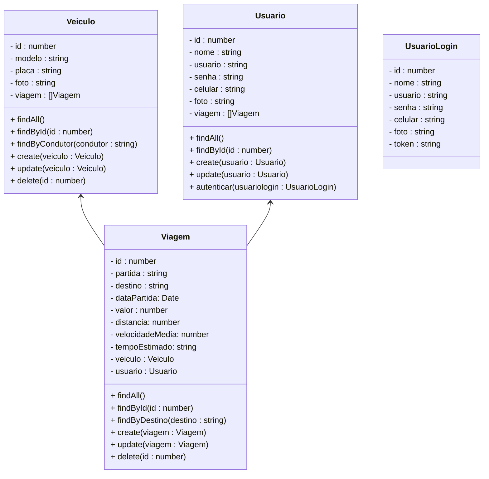

# Projeto Carona Compartilhada - Backend

 

    

  

## 1. Descrição

Um sistema de caronas compartilhadas é uma plataforma que permite que pessoas que fazem trajetos semelhantes compartilhem viagens em um mesmo veículo. Este tipo de sistema tem vários benefícios:

1. Redução de custos para os usuários
2. Diminuição do tráfego nas cidades
3. Redução da emissão de poluentes
4. Promoção de interação social

Normalmente, esses sistemas funcionam através de um aplicativo móvel ou plataforma web onde os usuários podem oferecer ou solicitar caronas, definindo rotas, horários e condições da viagem.

------

## 2. Sobre esta API

Esta API foi desenvolvida utilizando NestJS para criar a estrutura básica de um sistema de caronas compartilhadas. Ela fornece endpoints para gerenciar usuários, veículos e viagens, além de calcular o tempo estimado de uma viagem com base na distância e velocidade média.

### 2.1. Principais Funcionalidades

1. Cadastro e gerenciamento de usuários
2. Registro e gerenciamento de veículos
3. Criação e gerenciamento de viagens
4. Cálculo automático do tempo estimado de viagem

### 2.2. Cálculo do Tempo de Viagem

O sistema calcula automaticamente o tempo estimado de viagem baseado na distância e velocidade média fornecidas. Este cálculo é realizado no serviço `ViagemService` e o resultado é armazenado no campo `tempoEstimado` da entidade `Viagem`.

------

## 3. Diagrama de Classes

**Observações Importantes:**

- Estamos partindo do princípio de que os carros pertencem a uma frota, que são selecionados pelos motoristas no momento da criação de uma carona, para simplificar a implementação do sistema
- O método **calcularTempoViagem** deve atender a alguns requisitos:
  - Receber os parâmetros do tipo number **distancia e velocidade**
  - A distância deve ser expressa em **quilômetros (Km)**
  - A velocidade deve ser expressa em **quilômetros por hora (Km)**
  - Para calcular o tempo, utilizamos a fórmula: *tempo = distancia / velocidade*
  - O resultado final deve ser expresso em horas e minutos

------

## 4. Diagrama Entidade-Relacionamento (DER)

    

------

## 5. Tecnologias utilizadas

| Item                          | Descrição  |
| ----------------------------- | ---------- |
| **Servidor**                  | Node JS    |
| **Linguagem de programação**  | TypeScript |
| **Framework**                 | Nest JS    |
| **ORM**                       | TypeORM    |
| **Banco de dados Relacional** | MySQL      |

------

## 6. Configuração e Execução

1. Clone o repositório
2. Instale as dependências: `npm install`
3. Configure o banco de dados no arquivo `app.module.ts`
4. Execute a aplicação: `npm run start:dev`

